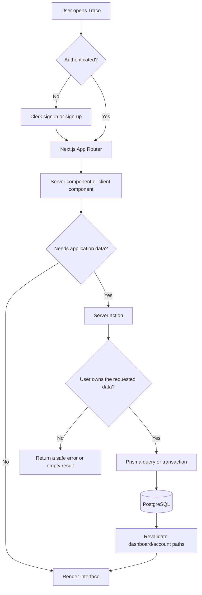
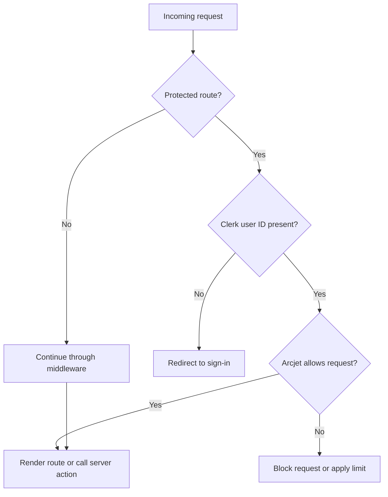
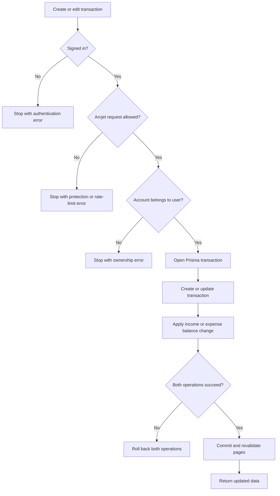
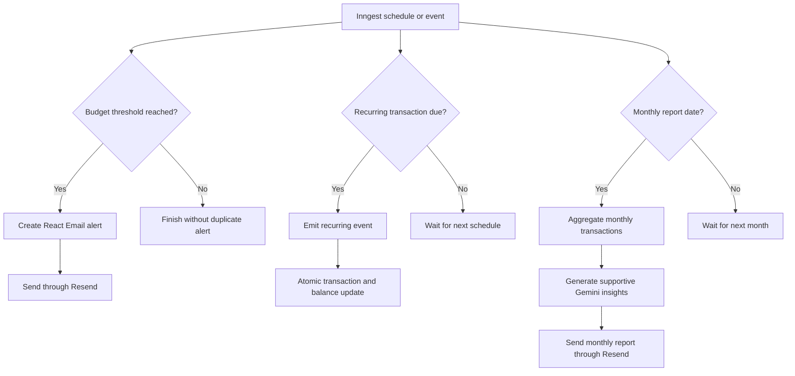
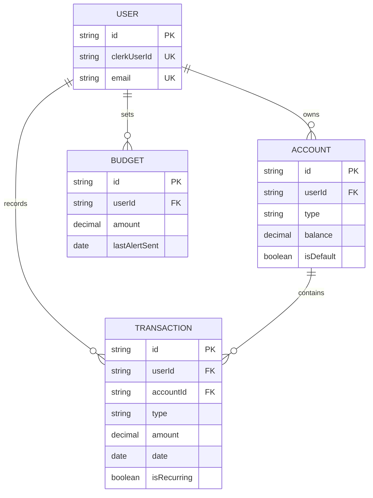

# 💰 Traco

**Traco** is a personal finance manager built to make money *make sense*. It gives people a clear, calm dashboard for their accounts, budgets, transactions, and spending trends — and turns raw numbers into insights they can actually act on.

The whole product is built around one simple idea:

> **Every recorded transaction gives the user more visibility, and every insight creates a practical next step.**

---

## ✨ Highlights

- 🔐 Secure sign-up and sign-in with **Clerk**
- 🏦 Personal accounts with savings/current types and a default account
- 💸 Income & expense tracking with categories, dates, statuses, and optional receipts
- ⚛️ Atomic balance updates on every create, edit, delete, or recurring cycle
- 📊 Monthly budgets with live progress tracking and automated alerts
- 📈 Dashboard charts for instant cash-flow and spending visibility
- 🧾 AI receipt scanning with **Google Gemini** to prefill transaction details
- 🔁 Recurring transactions processed by scheduled **Inngest** functions
- 📬 Monthly reports & budget-alert emails via **React Email** + **Resend**
- 🛡️ Bot protection, request shielding, and rate limiting with **Arcjet**
- 📱 Responsive UI built from reusable React components and Radix primitives

---

## 🧰 Why These Technologies

Every piece of the stack was picked to solve a specific problem well — not just because it's popular.

| Technology | Used For | Why It's the Right Fit |
| --- | --- | --- |
| **Next.js 16 (App Router)** | Pages, layouts, server rendering, server actions, API routes | Lets data live close to the server for speed and security, while still feeling instant and app-like for the user. |
| **React 19** | Interactive forms, dashboard sections, client components | A flexible, battle-tested component model — perfect for focused, fast-changing finance workflows. |
| **Clerk** | Authentication & user identity | Production-grade auth out of the box, so Traco never has to touch a password directly — identity stays dependable and secure. |
| **Prisma** | Database client & typed data access | Turns complex relational data (users → accounts → transactions → budgets) into safe, typed, easy-to-maintain queries. |
| **PostgreSQL** | Persistent storage | A rock-solid relational database for the kind of structured, connected data a finance app depends on. |
| **Server Actions** | Protected mutations & reads | Keeps authorization logic *right next to* the operation it protects — no separate API layer to drift out of sync. |
| **Inngest** | Scheduled jobs & event-driven work | Handles recurring transactions, alerts, and reports reliably in the background, even if a request fails midway. |
| **Arcjet** | Shielding, bot detection, rate limiting | Adds a quiet layer of trust — keeping abuse and bots out without adding friction for real users. |
| **Google Gemini** | Receipt extraction & financial insights | Turns a photo of a receipt or a month of numbers into something genuinely useful, cutting manual entry way down. |
| **Recharts** | Dashboard visualizations | Converts rows of transactions into charts people can actually read at a glance. |
| **Motion** | Page & UI animation | Small, purposeful motion makes the dashboard feel alive and responsive instead of static. |
| **Radix UI** | Dialogs, menus, selects, checkboxes | Accessible, robust interaction primitives — so the UI can look custom without reinventing keyboard and screen-reader behavior. |
| **Tailwind CSS** | Layout & styling | Fast, consistent styling that scales cleanly across a growing component library. |
| **React Hook Form + Zod** | Form state & validation | Keeps every transaction and account form predictable, fast, and safe from bad input. |
| **Resend + React Email** | Transactional email | Cleanly separates *what an email looks like* from *how it's sent*, so templates stay reusable. |
| **Sonner** | Toast feedback | Immediate, unobtrusive confirmation so users always know an action succeeded (or why it didn't). |

---

## 🚀 Getting Started

### Requirements

- Node.js compatible with the installed Next.js version
- A PostgreSQL database
- Clerk application credentials
- API credentials for any additional services you enable

### Install & Run

```bash
npm install
npx prisma generate
npm run dev
```

Then open [http://localhost:3000](http://localhost:3000) 🎉

### Useful Commands

```bash
npm run lint            # Check JavaScript and JSX quality
npm run build           # Create a production build
npm run start           # Run the production build
npx prisma migrate dev  # Apply schema changes
npx prisma studio       # Browse your database visually
npm run email           # Preview React Email templates
```

### Environment Variables

Create a local `.env` file — and keep secrets out of source control.

```env
DATABASE_URL="postgresql://..."
DIRECT_URL="postgresql://..."
NEXT_PUBLIC_CLERK_PUBLISHABLE_KEY="..."
CLERK_SECRET_KEY="..."
ARCJET_KEY="..."
GEMINI_API_KEY="..."
RESEND_API_KEY="..."
INNGEST_EVENT_KEY="..."
INNGEST_SIGNING_KEY="..."
```

> `DATABASE_URL` is used by Prisma's normal connection path; `DIRECT_URL` supports direct operations like migrations. The Inngest keys are required in production — local development can rely on Inngest's dev tooling instead.

---

## 🏗️ Architecture

Traco follows a full-stack App Router architecture: pages and layouts define the experience, server components load protected data, client components handle interaction, and server actions perform authorized business logic.

### Application Flow



### Request & Protection Architecture

`proxy.js` composes **Clerk** middleware with **Arcjet** middleware. Protected routes include the dashboard, transactions, and accounts. Server actions *also* independently check `auth()` and verify ownership — so protection happens at both the route level and the operation level.



### Transaction Architecture

Every transaction create/edit updates the account balance *in the same operation* — so the ledger and the balance can never silently drift apart.



### Background Workflow Architecture

The `/api/inngest` route registers four scheduled workflows that keep working even when nobody's looking at the app:

- **`checkBudgetAlert`** — runs every 6 hours, emails an alert once monthly spend hits 80% of budget
- **`triggerRecurringTransactions`** — runs daily, emits events for any recurring transaction that's due
- **`processRecurringTransaction`** — consumes those events, creates the transaction, updates the template, and adjusts the balance atomically
- **`generateMonthlyReports`** — runs on the 1st of each month, summarizes the prior month, generates Gemini insights, and emails the report



---

## 🗃️ Data Model

A relational model with clear, simple ownership at every level:

- **`User`** — the application profile, linked to a Clerk identity
- **`Account`** — belongs to a user; stores balance, type, and default-account state
- **`Transaction`** — belongs to a user *and* an account; stores income/expense details, category, receipt data, status, and recurrence metadata
- **`Budget`** — belongs to a user; stores the current budget amount and last alert timestamp
- Enum types keep account, transaction, recurrence, and status values consistent
- Foreign keys with cascade deletes keep related records aligned
- Indexes on ownership fields keep dashboard queries fast



---

## 📁 Folder Guide

| Path | Responsibility |
| --- | --- |
| `app/` | App Router pages, layouts, auth pages, dashboard pages, and API routes |
| `actions/` | Server actions for accounts, transactions, budgets, seed data, bulk deletion, and email helpers |
| `components/` | Product-level UI — charts, forms, account displays, receipt scanning, dashboard bootstrap |
| `components/ui/` | Reusable UI primitives and chart components |
| `lib/` | Prisma client, auth lookup, Arcjet config, Inngest functions, shared utilities |
| `prisma/` | Database schema and migrations |
| `emails/` | React Email templates for scheduled notifications and reports |
| `hooks/` | Reusable client hooks (e.g. server-action fetching state) |
| `public/` | Static images and visual assets |
| `proxy.js` | Authentication routing and request protection middleware |

---

## 🔄 Product Flow

1. A person creates an account or signs in through **Clerk**.
2. The dashboard layout verifies identity and creates the local Traco user (plus a primary account, if needed).
3. The user reviews balances, budgets, charts, and account activity on the dashboard.
4. A transaction is entered manually — or prefilled instantly by scanning a receipt with **Gemini**.
5. The server validates identity and ownership, then updates the transaction and balance together.
6. Dashboard and account pages revalidate, so the latest numbers appear immediately.
7. **Inngest** keeps working quietly in the background: recurring entries, budget alerts, monthly summaries.

---

## 🔒 Security & Reliability

- Authentication handled entirely by **Clerk** — no custom password storage
- Protected routes redirect unauthenticated visitors to sign-in
- Server actions independently re-verify identity *and* database ownership
- **Arcjet** adds shield protection, bot detection, and per-user rate limiting
- **Prisma transactions** protect balance consistency during multi-step updates
- Receipt uploads capped at 5 MB
- Sensitive credentials live only in environment variables
- Email delivery has an explicit authorized-recipient guard
- Revalidation keeps every dashboard value fresh right after a mutation

---

## 🌱 Positive Design Principles

- **Clarity first** — balances, budgets, and activity are presented so they're easy to scan at a glance
- **Progress over pressure** — reports and insights are written to be supportive and actionable, never alarmist
- **Automation with control** — recurring work is scheduled and traceable, but still shows up as normal account activity
- **Trust through consistency** — ownership checks, atomic updates, and reliable relational data support confident decisions
- **Helpful intelligence** — AI cuts down repetitive entry while keeping the user in control of the final transaction

---

## 🛠️ Development Notes

- Run `npx prisma migrate dev` after any schema change
- Keep server-only credentials and DB access inside server actions, route handlers, or server-side libraries — never client components
- When adding a balance-affecting operation, update the transaction *and* the account balance in the **same** Prisma transaction
- When adding a new protected page, add it to the route protection strategy and verify ownership in its data access path
- When adding a scheduled function, register it in `app/api/inngest/route.js` and document its schedule/purpose here

---

Built with [Next.js](https://nextjs.org) and bootstrapped with [`create-next-app`](https://github.com/vercel/next.js/tree/canary/packages/create-next-app).